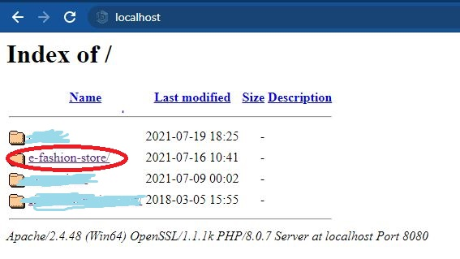

# e-fashion-store
The solely purpose of building this site is for practising my development skills. Although this is my first website. I had tried my best to make smooth user interface. I builded this website learning and applying along the way and enjoyed the process. I am still learning, exploring and trying to improve my development skills. Site is not completed yet.

Tech used : HTML, CSS, PHP, MYSQL, JAVASCRIPT

You can visit this website through this <a href="http://e-fashion-store.epizy.com/">link</a>

## Installation Prerequisites
***
- XAMPP
   
To Download XAMPP server visit [here](https://www.apachefriends.org/index.html)
 

## How to Run this Project
***

1. Clone this repository to your local machine to  
    File path: ` C:\xampp\htdocs ` (make sure to delete all pre exisiting file before cloning this repo)
2. Now open XAMPP Control Panel and start Apache and MySQL Module 
    
3. Open your browser and type `localhost/phpmyadmin/` inside url box
4. Create new database. 
   Click on New 
    
   Enter Database name and press on Create button 
   
5. Open your config.php file and enter your database name in `$database = ""` variable and save changes.
6. Now open url `localhost` on your browser. 
   Open cloned repo folder 
    
7. Your webpage will loaded immediately.
